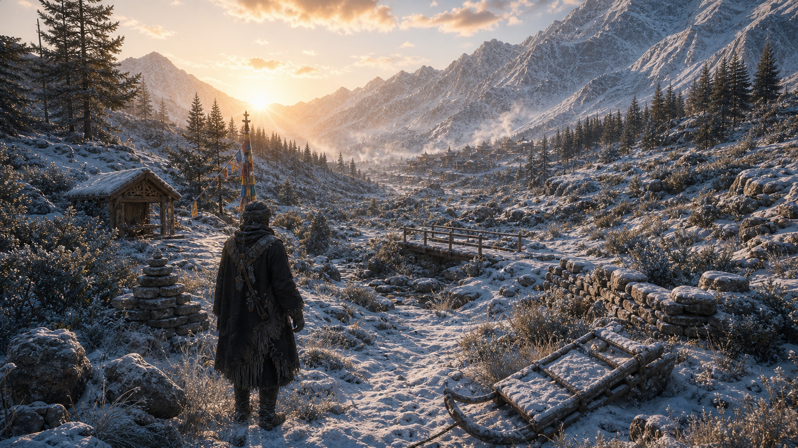
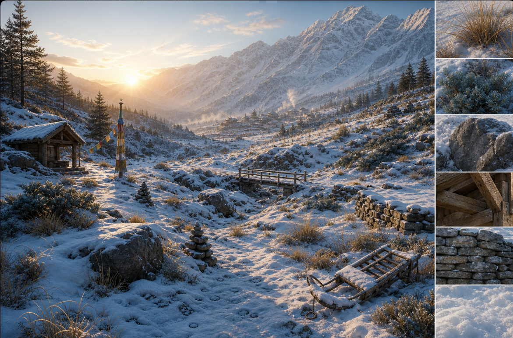
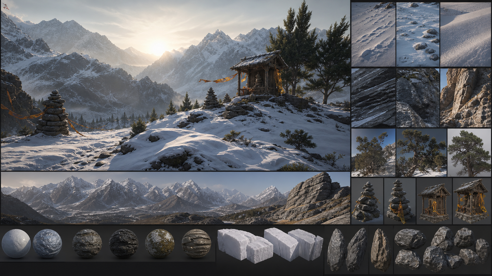

  

<h1 align="center">HIMLANDS</h1>

<strong>AN ALPINE FANTASY IN DEVELOPMENT</strong>

  <i>Beyond the last marked trail, the mountain remembers every step.</i>

---

## A world still taking shape

**Himlands** is a snowbound fantasy experience in active development: a high-altitude world of deep valleys, weathered shrines, ancient routes, and wind-carved silence. Its atmosphere is being built around the small things that make a place believable—the response of snow beneath a step, a track that stays behind, frozen light across stone, and a landscape that feels lived in long before the player arrives.

The project is being developed **for PC first**. Xbox and PlayStation are planned for a later phase, once the foundations of the world are ready to travel beyond the mountain pass.

> Every image, system, and location shown here is in development. The ambition is fixed; the details are still finding their final form.

---

## The valley, before the journey begins

  

An in-development gameplay view: a first glimpse of the mountain world Himlands is becoming.

The first destination is not designed as empty terrain between objectives. It is a place to read: a bridge suggests a crossing, a shrine suggests a story, an abandoned sled suggests someone was here before the snow arrived. Trails, settlements, and quiet detours are meant to matter as much as the horizon.

---

## Material language of the mountain

  

Surface study — snow, rock, timber, foliage, and the hand-built details that give the high country its character.

Himlands is being shaped around contrast: soft snow against hard rock, frost against weathered wood, untouched ridges against traces of passage. Its rendering, deformation, atmosphere, and environmental assets are being developed together so the landscape feels coherent at a distance and rewarding up close.

---

## The small things carry the altitude

  

Micro-detail study — overlooked objects, layered materials, and environmental storytelling for a world that feels inhabited.

From cairns and prayer-worn shelters to half-buried rocks, roots, grasses, and narrow tracks, the goal is density with purpose—not scenery scattered for decoration. The world is being built to feel quiet, harsh, sacred, and alive.

---

## Coming soon to PC

| Now | Next | Later |
| :-- | :-- | :-- |
| Building the alpine world, movement, snow systems, spellcraft, and environmental detail. | Expanding the playable journey and bringing its places, encounters, and atmosphere into focus. | Exploring Xbox and PlayStation releases after the PC foundation is ready. |

---

## The first beta, for the impatient

The current browser build is **Himlands' earliest and most prominent public phase**—a free, time-unlimited WebGPU beta where the original snow physics, traversal, spells, and simple surrounding world can be experienced today.

It is deliberately early: expect foundational physics and a much simpler environment than the world shown above. Please do not mistake the scaffolding for the cathedral. But if waiting has become genuinely unbearable, the mountain is open.

[Try the first Himlands beta in your browser →](https://himlands-v2.vercel.app)

Free to enter. No time limit. Just remember: it is the beginning, not the summit.

---

Himlands is an independent project in active development.

